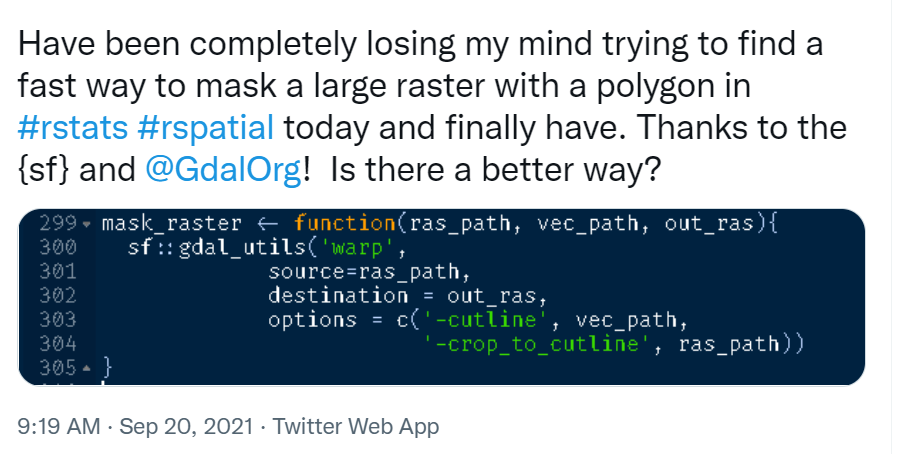
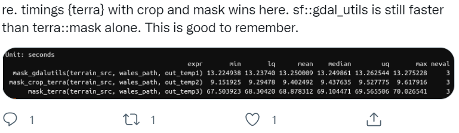

# Raster data

## Raster data with `terra`

Support for gridded data in R in recent year has been best implemented with the `raster` package by Robert Hijmans. The `raster` package allows you to:

* read and write almost any commonly used raster data format using `rgdal`
* perform typical raster processing operations such as resampling, projecting, filtering, raster math, etc.
* work with files on disk that are too big to read into memory in R
* run operations quickly since the package relies on back-end C code 

The [terra](https://github.com/rspatial/terra) package is the replacement for the `raster` package and has now superceeded it and we will largely focus on `terra` here. Examples here draw from both [Spatial Data Science with R and terra](https://rspatial.org/terra/index.html) and [An introduction to terra in Geocomputation with R](https://geocompr.robinlovelace.net/spatial-class.html#raster-data).  Use help("terra-package") in the console for full list of available `terra` functions and comparison to / changes from `raster`.

Raster representation is currently in flux a bit in R now with three choices of packages - `raster` and now `terra` which we've mentioned, as well as [stars](https://r-spatial.github.io/stars/index.html) (spatiotemporal tidy arrays with R).

To familiarize ourselves with the `terra` package, let's create an empty `SpatRaster` object - in order to do this we have to:
* define the matrix (rows and columns) 
* define the spatial bounding box

Note that typically we would be reading raster data in from a file rather than creating a raster from scratch. Run through code steps below to familiarize yourself with constructing a `RasterLayer` from scratch - you can provide a different bounding box for an area of your choosing.

```{r raster-layer, message=FALSE, warning=FALSE, error=FALSE}
library(terra)
myrast <- rast(ncol=10, nrow = 10, xmax=-116,xmin=-126,ymin=42,ymax=46)
# str(myrast)
isS4(myrast)
```

`terra` uses an `S4` slot structure with a `SpatRaster` object. Simply typing the name of the `SpatRaster` gives a summary of the object at the console.
```{r raster-layer2, message=FALSE, warning=FALSE, error=FALSE}
myrast
```

`terra` has dedicated functions addressing each of these components: 
  - `dim(my_rast)` returns the number of rows, columns and layers
  - `ncell()` returns the number of cells (pixels)
  - `res()` returns the spatial resolution
  - `ext()` returns spatial extent
  - `crs()` returns the coordinate reference system

### Exercise
Exploring raster objects 

1. what is the minimal data required to define a `SpatRaster`? 
2. What is the CRS of our `SpatRaster`? 
3. How do we pull out just the CRS for our r `SpatRaster`? 
4. Building on this, what is the code to pull out just our xmin value in our extent, or bounding box?

### Solution

1. number columns, number rows, and extent - the `raster` package however will fill in defaults if values aren't provided
```{r raster-emptyexample, message=FALSE, warning=FALSE, error=FALSE}
t <- rast()
t
```

2. We didn't provide one - `terra` uses default `crs` of WGS84 if you don't provide a `crs`

3. 
```{r message=FALSE, warning=FALSE, error=FALSE}
crs(myrast)
```

4. 
```{r message=FALSE, warning=FALSE, error=FALSE}
ext(myrast)
# just grab xmin
ext(myrast)[1]
# we can see that extent is actually a c++ object in the ptr slot of our spatRaster object
# str(myrast)
# names(myrast@ptr)
myrast@ptr$extent
```

### Manipulating `raster` objects
So far we just have a container with no values (try plotting what we have so far) - let's provide values to the cells using the runif function to derive random values from the uniform distribution
```{r runif, message=FALSE, warning=FALSE, error=FALSE}
#show we have no values
hasValues(myrast)
values(myrast) <- runif(n=ncell(myrast))
myrast
```

An important point to make here is that objects in the `terra` package (and previously in `raster`) can be either in memory or on disk - note the value for our `spatRaster` r of 'source'.  If this were a large raster on disk, the value would be the path to the file on disk.

```{r inmemory, message=FALSE, warning=FALSE, error=FALSE}
myrast@ptr$inMemory
hasValues(myrast)
myrast@ptr$nlyr() # we just have one layer in our object
# or
nlyr(myrast)
```

`terra` also provides plot method for it's classes:
```{r plot raster, message=FALSE, warning=FALSE, error=FALSE}
plot(myrast)
```

We can also overwrite the cell values for our raster:
```{r new_values_raster, message=FALSE, warning=FALSE, error=FALSE}
values(myrast) <- 1:ncell(myrast)
values(myrast)[1:15]
```

You can access raster values via direct indexing or line, column indexing - take a minute to see how this works using raster r we just created - the syntax is:
```r
myrast[i]
myrast[line, column]
```
How is `terra` data storage unlike a `matrix` in R?  You can create a `matrix` with same dimensions and values and compare if you want:
```{r matrix_raster, message=FALSE, warning=FALSE, error=FALSE}
m <- matrix (1:100, nrow=10, ncol=10)
m[1,10]
myrast[1,10]
myrast[10]
```

### Reading existing rasters on disk
```{r single_raster, message=FALSE, warning=FALSE, error=FALSE}
raster_filepath = system.file("raster/srtm.tif", package = "spDataLarge")
my_rast = rast(raster_filepath)
nlyr(my_rast)
plot(my_rast)
```

### Multiband rasters
The `spatRaster` object in `terra` can hold multiple layers (similar to `RasterBrick` and `RasterStack` which were two additional classes in the `raster` package).  These layers correspond to multispectral satellite imagery or a time-series raster.

```{r multiband, message=FALSE, warning=FALSE, error=FALSE}
landsat = system.file("raster/landsat.tif", package = "spDataLarge")
landsat = rast(landsat)
landsat
plot(landsat)
```

### Plotting rasters and vectors with tmap
Bring in boundary and elevation of Crater Lake NP (datasets in `Rspatialworkshop` package) and plot with tmap
```{r tmap_raster_plot, message=FALSE, warning=FALSE, error=FALSE}
library(Rspatialworkshop)
library(tmap)
data(CraterLake)
raster_filepath <- system.file("extdata", "elevation.tif", package = "Rspatialworkshop")
elevation <- rast(raster_filepath)

map_crlk <- tm_shape(CraterLake) + tm_polygons(lwd = 2)
map_crlkel = map_crlk +
  tm_shape(elevation) + tm_raster(alpha = 0.7,palette = terrain.colors(12)) + tm_layout(legend.position = c("left","bottom"),
          legend.width = 1)

map_crlkel
```

## Raster data with `stars`

`stars` works with and stands for spatio-temporal arrays and can deal with more complex data types than either `raster` or `terra` such as rotated grids.

`stars` integrates with `sf` and many sf functions have methods for `stars` objects (i.e. `st_bbox` and `st_transform`) - this makes sense since they are both written by Edzer Pebesma. `terra` unfortunately has poor / no integration with `sf` - this is a big issue for me personally and I will likely look to `stars` long-term for my raster processing.

### Read a satellite image
Basic example shown in [stars vignette](https://r-spatial.github.io/stars/articles/stars1.html) - using the 30m bands of a Landsat-7 image that comes with the `stars` package:
```{r stars_1, message=FALSE, warning=FALSE, error=FALSE}
library(stars)
tif = system.file("tif/L7_ETMs.tif", package = "stars")
ls7 = read_stars(tif)
plot(ls7, axes = TRUE)
```

ls7 (landsat7) is an object with 3 dimensions (x,y and band) and 1 attribute
```{r stars_2, message=FALSE, warning=FALSE, error=FALSE}
ls7
```

Note when we plotted above that the `plot` method with `stars` uses histogram stretching across all bands - we can also do stretching for each band indivially:
```{r stars_3, message=FALSE, warning=FALSE, error=FALSE}
plot(ls7, axes = TRUE, join_zlim = FALSE)
```

`stars` uses [tidyverse methods for spatio-temporal arrays](https://r-spatial.github.io/stars/articles/stars3.html) - an example of this is pulling out one band of an image using `slice`
```{r stars_4, message=FALSE, warning=FALSE, error=FALSE}
ls7 %>% dplyr::slice(band, 6) -> band6
band6
```

This gives us a lower-dimensional array of just band 6 from the Landsat7 image.

## Raster Operations

### Projecting
For spatial operations in R, raster or vector, we always need to make sure objects are in an appropriate CRS and in the same CRS as one another.

We'll use the elevation data and Crater Lake polygon feature in the `Rspatialworkshop` package for this example.
```{r projection, message=FALSE, warning=FALSE, error=FALSE}
library(Rspatialworkshop)
data(CraterLake)
raster_filepath <- system.file("extdata", "elevation.tif", package = "Rspatialworkshop")
elevation <- rast(raster_filepath)
```

#### Exercise
1. Find the projection of both the Crater Lake spatial polygon feature and the elevation raster
2. Are they the same? Should we project one to the other, or apply a new projection?

#### Solution
1. Check the CRS of each feature and test for equality
```{r projection2, message=FALSE, warning=FALSE, error=FALSE}
crs(elevation)
st_crs(CraterLake)
st_crs(CraterLake) == crs(elevation)
st_crs(CraterLake)$wkt == crs(elevation)
```
2.  They share the same EPSG code, but are parameterized slightly differently for each - the `crs` function in `terra` does not include the `input` list item that `st_crs` in `sf` does - they are the same though as demonstrated when specifying the `wkt` item only from `st_crs(CraterLake)`
3. Each feature is in WGS84, an unprojected CRS - for most operations, we would prefer to have them in a projected CRS

#### Exercise
Find an appropriate area-preserving projection using [Projection Wizard](https://projectionwizard.org/#) or [spatialreference.org](https://spatialreference.org/) or any means you prefer and project both Crater Lake and elevation to this CRS.

#### Solution
Here I'll apply a custom Transverse Mercator I found the WKT representation for using Projection Wizard.  Another good projection would be [UTM zone 10N](https://spatialreference.org/ref/epsg/3157/) or [UTM zone 11N](https://spatialreference.org/ref/epsg/2153/)
```{r projection3, message=FALSE, warning=FALSE, error=FALSE}
tranvmerc <- 'PROJCS["ProjWiz_Custom_Transverse_Mercator", GEOGCS["GCS_WGS_1984", DATUM["D_WGS_1984", SPHEROID["WGS_1984",6378137.0,298.257223563]], PRIMEM["Greenwich",0.0], UNIT["Degree",0.0174532925199433]],PROJECTION["Transverse_Mercator"],PARAMETER["False_Easting",500000],PARAMETER["False_Northing",0.0],PARAMETER["Central_Meridian",-483.2226562],PARAMETER["Scale_Factor",0.9996],PARAMETER["Latitude_Of_Origin",0.0],UNIT["Meter",1.0]]'
elevation_tm <- project(elevation, tranvmerc, method = "bilinear")
crs(elevation_tm)
CraterLake_tm <- st_transform(CraterLake,tranvmerc)
```

### Cropping
We can crop our elevation raster to just the bounding box of Crater Lake - using mask, we can clip it to the actual polygon boundary

Let's see what elevation and Crater Lake boundary look like prior to cropping and masking
```{r crop, message=FALSE, warning=FALSE, error=FALSE}
plot(elevation_tm)
plot(CraterLake_tm, add=TRUE, col=NA, border='blue')
```

Here we use `crop` to crop the elevation raster to the bounding box of our Crater Lake polygon feature
```{r crop2, message=FALSE, warning=FALSE, error=FALSE}
elev_crop = crop(elevation_tm, vect(CraterLake_tm))
plot(elev_crop)
plot(CraterLake_tm, add=TRUE, col=NA, border='blue')
```

And finally we can use `mask` to mask the raster to just inside the polygon outline of Crater Lake National Park.  

**Note** - if you have a large raster, it makes a HUGE difference to use crop first, then mask - mask is a much more computationally intensive operation so it will pay off to crop first then mask. An interesting twitter thread regarding this just the other day:

```{r, echo=FALSE, out.width="150%"}

```

```{r, echo=FALSE, out.width="150%"}

```


```{r mask, message=FALSE, warning=FALSE, error=FALSE}
elev_mask = mask(elevation_tm, vect(CraterLake_tm))
plot(elev_mask)
plot(CraterLake_tm, add=TRUE, col=NA, border='blue')
```

### Map Algebra
We can divide map algebra into a couple of categories:

1. Local - per-cell operations
    a. raster calculator
    b. replacing values
    c. reclassifying
    d. calculating indices
2. Focal (neighborhood operations) - summarizing output cell value as the result of a window (such as a3 x 3 input cell block)
Zonal operations - summarizing raster values for some zones (either another raster or a vector feature)
Global - summarizing values over entire raster(s)

#### Local Operations
Say we want to convert our elevation raster from meters to feet:
```{r local, message=FALSE, warning=FALSE, error=FALSE}
elev_feet = elevation_tm * 3.28084
elev_feet
```

Our max value is 8890, which makes sense - the high point in Crater Lake National Park is Mount Scott at 8,929'.

What if we want to make elevation bins, or classify some elevations as NA with our elevation raster?
```{r local2, message=FALSE, warning=FALSE, error=FALSE}
reclass <- matrix(c(0, 500, 1, 500, 1000, 2, 1000, 1500, 3, 1500 , 2000, 4, 2000, 2700, 5), ncol = 3, byrow = TRUE)
reclass
elev_recl = classify(elevation_tm, rcl = reclass)
plot(elevation_tm)
plot(elev_recl)
```

```{r local3, message=FALSE, warning=FALSE, error=FALSE}
elev_new = elevation_tm
elev_new[elev_new > 2000] = NA
plot(elev_new)
```

#### Focal Operations
A simple focal window operation
```{r focal, message=FALSE, warning=FALSE, error=FALSE}
elev_focal_mean = focal(elevation_tm, 
                   w = matrix(1, nrow = 25, ncol = 25), 
                   fun = mean)
plot(elev_focal_mean)
```

#### Global Operations
```{r global, message=FALSE, warning=FALSE, error=FALSE}
terra::global(elev_mask, fun="mean", na.rm=TRUE)
terra::global(elev_mask, fun="sum", na.rm=TRUE)
```

#### Zonal Operations
Here us demonstrate using the zonal function in terra to summarize a value raster of elevation, using an srtm.tif from `spDataLarge`, by the zones of NLCD classes using nlcd.tif raster also in the `spDataLarge` package.
```{r zonal, message=FALSE, warning=FALSE, error=FALSE}
srtm_path = system.file("raster/srtm.tif", package = "spDataLarge")
srtm_path
srtm = rast(srtm_path)
srtm

nlcd = rast(system.file("raster/nlcd2011.tif", package = "spDataLarge"))
srtm_utm = project(srtm, nlcd, method = "bilinear")
srtm_zonal = zonal(srtm_utm, nlcd, na.rm = TRUE, fun = "mean")
srtm_zonal
```

